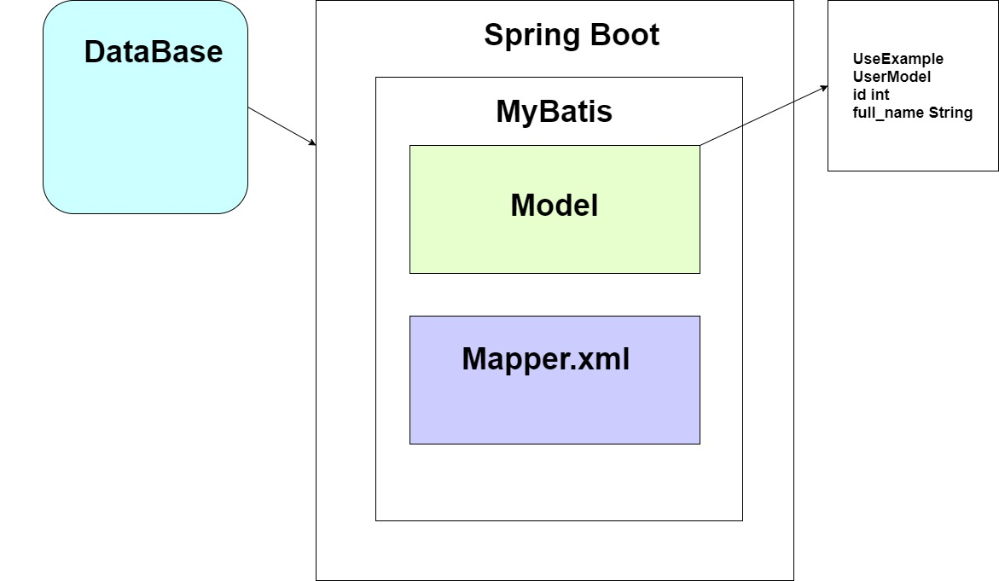

# Spring Boot build in Grandle
* Hướng dẫn cách build project với Grandle.
* So sánh điểm khác biệt với Project Maven thông thường...
* Project được xây dựng và chạy trên IDE: Eclipse 
	
	* Eclipse IDE for Enterprise Java and Web Developers (includes Incubating components)
	* Version: 2021-06 (4.20.0)
	* Build id: 20210612-2011

## Bài 1: Giới thiệu Spring Boot và tài liệu Spring Boot
* Cách đọc tài liệu Quickstart
* Cách đọc tài liệu core
* Cách triển khai các tính năng core của Spring Boot

## Bài 2: Hướng dẫn tạo project Spring Boot
* Tạo project dựa trên maven or grandle

## Bài 3: Hướng dẫn tạo project Spring Boot sử dụng Spring Security, Thymeleaf
* Không sử dụng jsp nữa -> vì bất tiện, code java trong html. 
* Thymeleaf - thiết kế giao diện Template Enginer
    * Phân quyền
        * Sài các Annotation, Attribute.
        * Quyền để thực hiện các action...
        * o7planing, thymeleaf.org.
    * Những bộ thư viện cần dùng khi làm việc với Web:
        * Web | Spring Security | Thymeleaf
        * MySQL...

    * Những bộ thư viện cần dùng khi làm việc với API:
        * Web
        * JWT | Authen2..
        * MySQL Driver, PostgressSQL, Oracle..

## Bài 4: Hướng dẫn cài đặt MySQL Server
* Các bước cài đặt MySQL Server
    * Mục đích sẽ cho mở kết nối đến Server Database.
    + Cài đặt MySQL Workbend.
    + Sử dụng Spring Boot kết nối đến Database
    + Làm sao để kết nối
    + Làm sao để biết kế nối thành công.

## Bài 5: Kết nối mysql và Spring Boot
+ Hoàn chỉnh project kết hợp của Spring Boot với MySQL
    + Vần đề làm việc khi thiết kế bảng, có nên thiết kế theo các chuẩn.
        + Nếu chuẩn càng nhiều thì lúc query lên dữ liệu càng tốn thời gian.
    + Vần đề về các config dùng khi cấu hình project
        + Không ai nhớ hết được config đó cả, làm dần thì sẽ quen thôi.
        + Quan trọng là phải nhớ, nắm rõ cái luồng nó đi trong dữ liệu như thế nào, đi từ đâu đến đâu.
        + Các Core property (Cache, Mail, ...)
    + Vấn đề về template view:
        + Các view trả về cho client được đặt ở trong: resouce/template/index.html
    
    + Vấn đề về controller: một thành phần điều hướng các request.
        + Single -> chi tách nhỏ các controller thì sau dễ dàng maintance.
        + @Controller, @RequestMapping, @GetMapping, @PostMapping...
    
    + Vấn đề về Base-login: mặc định có khi cài đặt thư viện của Spring-security
        + Để tránh nó thì cần phải né toàn bộ các config của Spring-security đó ra:

            ```java
            @SpringBootApplication(exclude = { SecurityAutoConfiguration.class })
            ```
+ Luồng đi chính trong Spring Boot:
    + Mục đích:
        + Nắm rõ luồng đi chính trong Spring Boot sẽ dễ dàng thao tác với các thành phần bên trong nhớ, cũng như dễ trong việc chỉnh sửa nó sau này.
    

## Bài 7: Hướng dẫn config DataSource MyBatis
+ Có bao nhiêu cách config Database: 3 cách chính
    + Cách 1: Cách config từ application.properties
        + Three way to config Spring Boot Data Source
        + Giới thiệu chung về MyBatis:
            + Làm thế nào để có thể kết nối đến Databa.
            + Làm sao để MyBatis có thể link được đến:
                + Model File -> có kiểu dữ liệu tương tự như trong Database. 
                + Tầng mapper: Khi thực thi câu query bất kì -> class UserExample -> định nghĩa ra các câu query đơn giản.
    + Flow chính của MyBatis:
        
    + Cách 2: Cách tạo ra từ file Java Config
    + Cách 3: Cách tạo ra một file Springboot.xml
    

## Bài 8: Cách sử dụng Criteria MyBatis để lấy dữ liệu

+ Việc sử dụng các CreateCriteria để thực thi các câu lệnh query theo cách có sẵn.
	+ Sử dụng với các điều kiện And
	+ Các điều kiện Or thì hiện chưa có trong phần này.
	+ Những logic thì không phải lúc nào cũng chỉ là những điều kiện đó, nên bắt buộc phải custom lại việc query dạng này.


## Bài 9: Hướng dẫn Custom query xml trong MyBatis

+ Tập trung vào việc viết câu query mà muốn custom lại các điều kiện của nó thì sẽ làm như nào.
+ select, update, insert, delete -> ứng với 4 nghiệm vụ hay dùng ở trong Database.


## Bài 10: Hướng dẫn Config Datasource dùng Java File

+ Cách thứ 2: Trong phần cấu hình Datasource để kết nối đến Cơ sở dữ liệu:
	+ Mục đích sử dụng các Annotation làm việc với Java Code, chứ không dùng những cái có sẵn.
	+ Khi tạo file Datasource bằng Spring Boot -> các thông tin trong application.properties thì không mã hóa nó.
	+ Nếu người ra lấy được thì sẽ đọc được các thông số
	+ Lúc này họ tạo kết nối đến database và thực hiện truy vấn.
		+ Lý do tại sao Neo dùng các tên alias...
		+ Không sài các từ khóa mặc định được dùng trong Spring: spring.xxxx mà dùng các từ khóa khác để thay thế chúng.
	+ Về việc cấu hình Datasource
		+ Cấu hình Bean cho DataSource
		+ Cấu hình cho TransactionManager
		+ Cấu hình cho SqlSessionFactory
		

## Bài 11: Mã hóa dữ liệu trong Java

+ Cách mã hóa dữ liệu các thông tin configuration: user_name, password, url (-urlClassName)
	+ Vì java sẽ giúp cho công việc mã hóa các thông tin config này.
		+ Encrypt and decrypt in Java | Java Core
		+ [Java AES Encryption Example](https://howtodoinjava.com/java/java-security/java-aes-encryption-example/)


## Bài 12: Hướng dẫn Spring Security
+ Spring Security
	+ Vì sau này cho các chức năng đăng nhập v.v đòi hỏi độ bảo mật cao hơn. Chống lại các tấn công, chứng thực JSON, chứng thực API.
	+ Cách tìm hiểu từ ban đầu:
		+ Spring Security nó làm gì, tại sao phải dùng nó.
			+ Spring Security Tutorial | Basic | Example (-sau khi đi qua phần Basic)
				+ Nên tìm Project trên github -> giúp biết họ đang làm gì, cấu hình như nào.
			+ Nếu muốn biết nó còn mở rộng gì nữa thì vào chính trang chủ của nó.
	
	+ Custom lại trạng login.
			


## Bài 13: Spring Security cấu hình form login
+ Kiểm tra lại phần giao diện bị bể -> không ăn css cho form login
	+ Nếu các request vào các trang đó đều phải chứng thực thì để xem được các file css, js của nó thì đều phải cấp quyền thì mới xem được -> 1 điểm cộng
	+ Xây dựng các loại chứng thực
		+ AuthenticationManagerBuilder
		


## Bài 14: Thực hiện chức năng đăng nhập + MyBatis
+ Bài trước đã cấu hình dược phần Spring Security nhưng nó chỉ là phần tĩnh, chưa động
	+ Giờ muốn cấu hình nó động -> lấy dữ liệu từ Database.
	


## Bài 15: Config Spring Security mà không cần đăng nhập
+ Client -> khi vào một trang thì không phải lúc nào cũng bắt họ phải login vào.


## Bài 16: 
## Reference Document
* [Youtube](https://www.youtube.com/channel/UCcs1LzFMe-K4FMDDtvbMSww)
* [Official Gradle documentation](https://docs.gradle.org)
* [Accessing data with MySQL](https://spring.io/guides/gs/accessing-data-mysql/#scratch)
* [Common Application Properties](https://docs.spring.io/spring-boot/docs/current/reference/html/application-properties.html)
* [Three ways to configure Spring Boot + Mybatis data source](https://www.programmersought.com/article/8672121650/)

