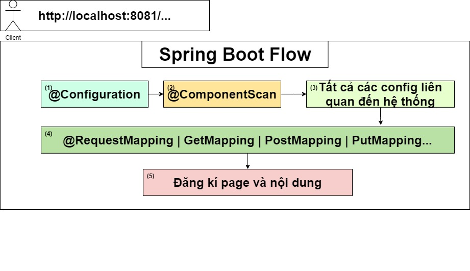

# Spring Boot build in Grandle
* Hướng dẫn cách build project với Grandle.
* So sánh điểm khác biệt với Project Maven thông thường...

## Bài 1: Giới thiệu Spring Boot và tài liệu Spring Boot
* Cách đọc tài liệu Quickstart
* Cách đọc tài liệu core
* Cách triển khai các tính năng core của Spring Boot

## Bài 2: Hướng dẫn tạo project Spring Boot
* Tạo project dựa trên maven or grandle

## Bài 3: Hướng dẫn tạo project Spring Boot sử dụng Spring Security, Thymeleaf
* Không sử dụng jsp nữa -> vì bất tiện, code java trong html. 
* Thymeleaf - thiết kế giao diện Template Enginer
    * Phân quyền
        * Sài các Annotation, Attribute.
        * Quyền để thực hiện các action...
        * o7planing, thymeleaf.org.
    * Những bộ thư viện cần dùng khi làm việc với Web:
        * Web | Spring Security | Thymeleaf
        * MySQL...

    * Những bộ thư viện cần dùng khi làm việc với API:
        * Web
        * JWT | Authen2..
        * MySQL Driver, PostgressSQL, Oracle..

## Bài 4: Hướng dẫn cài đặt MySQL Server
* Các bước cài đặt MySQL Server
    * Mục đích sẽ cho mở kết nối đến Server Database.
    + Cài đặt MySQL Workbend.
    + Sử dụng Spring Boot kết nối đến Database
    + Làm sao để kết nối
    + Làm sao để biết kế nối thành công.

## Bài 5: Kết nối mysql và Spring Boot
+ Hoàn chỉnh project kết hợp của Spring Boot với MySQL
    + Vần đề làm việc khi thiết kế bảng, có nên thiết kế theo các chuẩn.
        + Nếu chuẩn càng nhiều thì lúc query lên dữ liệu càng tốn thời gian.
    + Vần đề về các config dùng khi cấu hình project
        + Không ai nhớ hết được config đó cả, làm dần thì sẽ quen thôi.
        + Quan trọng là phải nhớ, nắm rõ cái luồng nó đi trong dữ liệu như thế nào, đi từ đâu đến đâu.
        + Các Core property (Cache, Mail, ...)
    + Vấn đề về template view:
        + Các view trả về cho client được đặt ở trong: resouce/template/index.html
    
    + Vấn đề về controller: một thành phần điều hướng các request.
        + Single -> chi tách nhỏ các controller thì sau dễ dàng maintance.
        + @Controller, @RequestMapping, @GetMapping, @PostMapping...
    
    + Vấn đề về Base-login: mặc định có khi cài đặt thư viện của Spring-security
        + Để tránh nó thì cần phải né toàn bộ các config của Spring-security đó ra:

            ```java
            @SpringBootApplication(exclude = { SecurityAutoConfiguration.class })
            ```
+ Luồng đi chính trong Spring Boot:
    + Mục đích:
        + Nắm rõ luồng đi chính trong Spring Boot sẽ dễ dàng thao tác với các thành phần bên trong nhớ, cũng như dễ trong việc chỉnh sửa nó sau này.
    

## Bài 7: Hướng dẫn config DataSource MyBatis
+ Có bao nhiêu cách config Database: 3 cách chính
    + Cách 1: Cách config từ application.properties
        + Three way to config Spring Boot Data Source
        + Giới thiệu chung về MyBatis:
            + Làm thế nào để có thể kết nối đến Databa.
            + Làm sao để MyBatis có thể link được đến:
                + Model File -> có kiểu dữ liệu tương tự như trong Database. 
                + Tầng mapper: Khi thực thi câu query bất kì -> class UserExample -> định nghĩa ra các câu query đơn giản.
                
                
    + Cách 2: Cách tạo ra từ file Java Config
    + Cách 3: Cách tạo ra một file Springboot.xml
    

## Reference Document
* [Youtube](https://www.youtube.com/channel/UCcs1LzFMe-K4FMDDtvbMSww)
* [Official Gradle documentation](https://docs.gradle.org)
* [Accessing data with MySQL](https://spring.io/guides/gs/accessing-data-mysql/#scratch)
* [Common Application Properties](https://docs.spring.io/spring-boot/docs/current/reference/html/application-properties.html)


